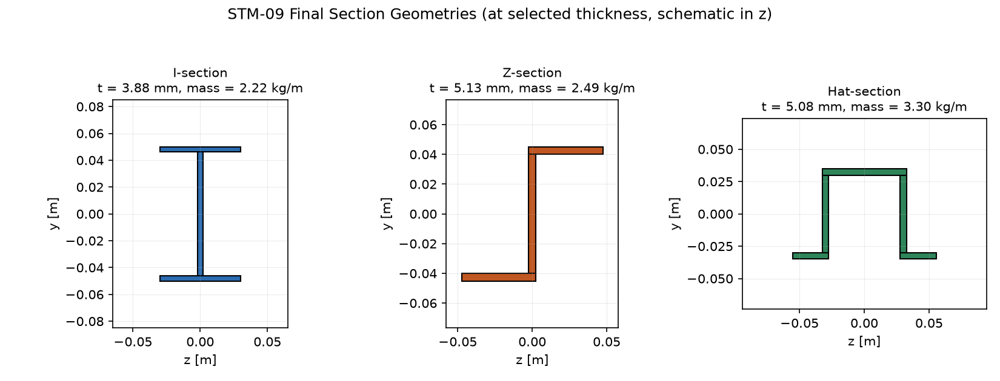
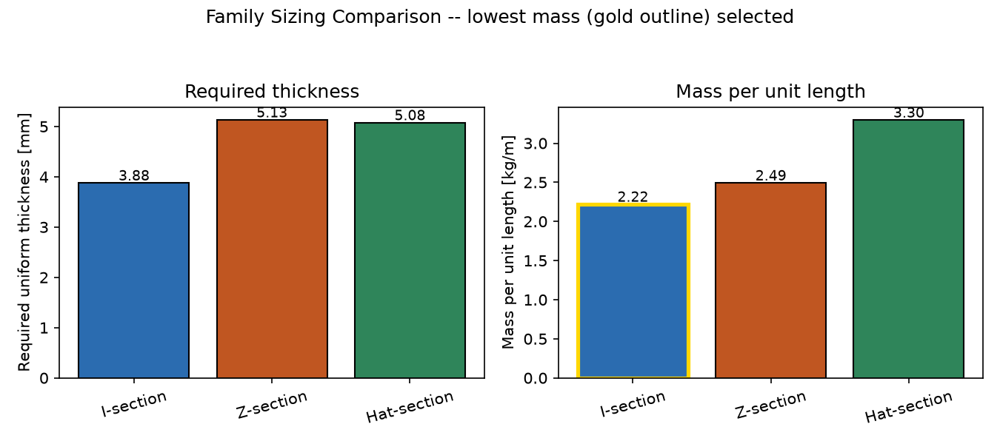
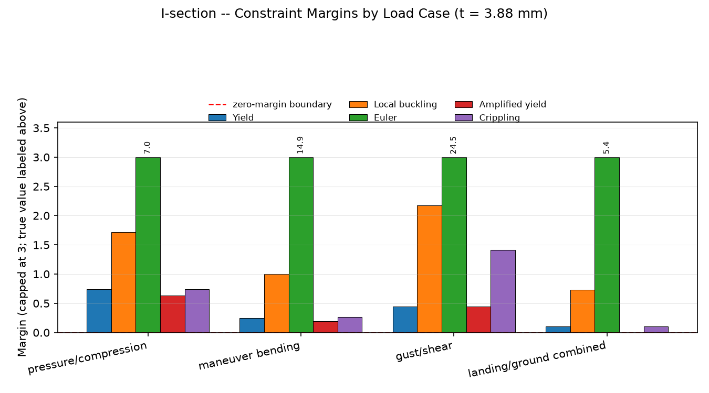
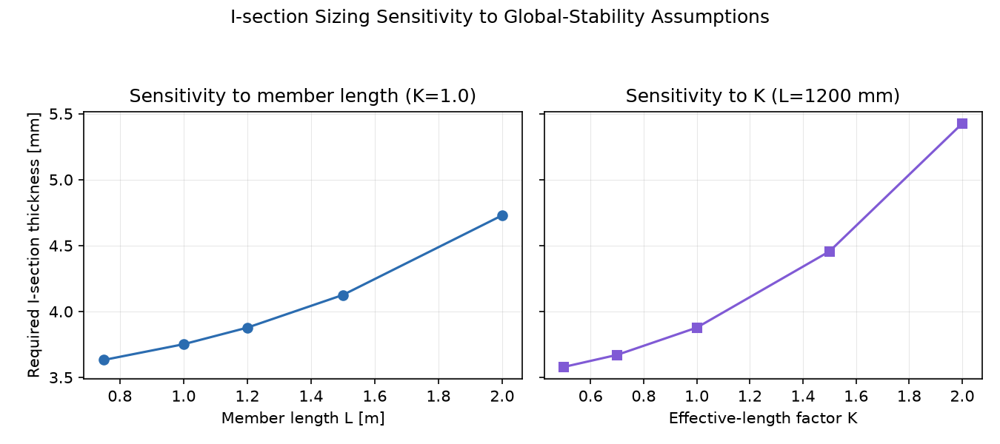
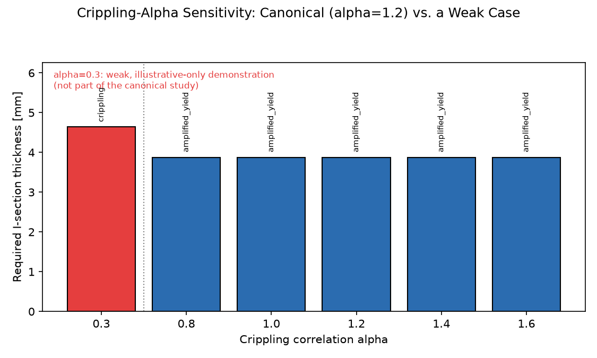

# fuselage-frame-stringer-sizing (STM-09)

A from-scratch, independently-verified beam-section mechanics library for
preliminary fuselage frame/stringer sizing — built up in seven milestones
from a single rectangular beam through built-up I/Z/hat sections, local
plate buckling, global Euler/beam-column stability, an illustrative
empirical crippling screen, and a constrained multi-load-case sizing
study, finishing with this final audit, figures, and consolidated report.

**This is an illustrative preliminary engineering study, not a
flight-qualified structural design or a certification tool.**

## 1. Project objective

Given an illustrative aluminum-like material, a small set of illustrative
combined axial/shear/bending load cases, and a bounded uniform-thickness
design space, determine the lowest-mass preliminary I/Z/hat frame/stringer
section that survives independently-verified material yield, local plate
buckling, global member (Euler) stability, beam-column moment
amplification, and an empirical crippling screen — and characterize how
robust that conclusion is to the principal modeling assumptions (member
length, end restraint, panel length, minimum gauge, and the crippling
correlation's own coefficients).

## 2. Key result

| Family | Required t | Mass/length | Governing load case | Governing constraint | Status |
|---|---|---|---|---|---|
| **I-section** | **3.877 mm** | **2.222 kg/m** | landing/ground combined | amplified_yield | **PASS** |
| Z-section | 5.132 mm | 2.494 kg/m | landing/ground combined | amplified_yield | PASS |
| Hat-section | 5.076 mm | 3.298 kg/m | landing/ground combined | amplified_yield | PASS |

**Selected: I-section, uniform thickness 3.877 mm, mass/length 2.222
kg/m** — the lowest-mass feasible family under identical assumptions
applied to all three (same material, load cases, panel length, member
geometry, minimum gauge, crippling correlation, and search bounds). This
is an **illustrative preliminary uniform-thickness section
recommendation**, not a globally optimized or certified design; values
are precise only to the stated ±1 µm bisection tolerance and the fidelity
of the underlying illustrative model, not to more decimal places than
that implies.

Reproduce this table yourself: `python examples/final_frame_stringer_assessment.py`.




## 3. Engineering workflow

| Milestone | Question answered | Module(s) |
|---|---|---|
| 1 | Verified elementary rectangular beam mechanics (axial, bending, shear, von Mises yield) | `geometry`, `material`, `stress`, `strength`, `mass` |
| 2 | Moving material away from the neutral axis improves bending efficiency — built-up I/Z/hat sections | `built_up_geometry`, `sections`, `built_up_stress`, `built_up_strength` |
| 3 | Thin individual plate elements can locally buckle below yield | `plate_buckling`, `local_buckling` |
| 4 | Whole-member slenderness introduces Euler/beam-column effects | `column_buckling`, `beam_column` |
| 5 | An empirical, illustrative crippling correlation screens section-level collapse | `crippling`, `structural_status` |
| 6 | All constraints evaluated across several load cases size fixed-geometry uniform-gauge families | `load_cases`, `sizing`, `design_study` |
| 7 | Final audit, canonical script, figures, and this consolidated report | `examples/final_frame_stringer_assessment.py`, `examples/generate_figures.py` |

**Final lesson:** the lowest-mass section is not selected by bending
efficiency alone; it must survive independent material, local-instability,
global-stability, and empirical crippling checks across every load case.

## 4. Coordinates and conventions

Local member axes: `x` = longitudinal axis, `y` = section vertical
coordinate, `z` = section lateral coordinate.

Loads: `N` (axial, **positive = tension**), `V_y` (transverse shear,
signed), `M_z` (bending moment, signed). Stress: positive `sigma_x` =
tension; `tau_xy` signed internally, magnitude used in strength/buckling
screens. Units: SI throughout (m, m², m⁴, N, N·m, Pa, kg/m³, kg/m).

## 5. Section mechanics (Milestone 1)

A single rectangular section (`RectangularSection`) establishes every
hand-verifiable baseline formula before any built-up geometry is
introduced:

```
A = b*h                          I_z = b*h^3/12                S_z = I_z/(h/2)
sigma_x(y) = N/A - M_z*y/I_z     tau_xy(y) = (3/2)*(V_y/A)*[1-(2y/h)^2]
sigma_vm = sqrt(sigma_x^2 + 3*tau_xy^2)      MS_yield = sigma_y/sigma_vm - 1
```

Representative sanity case (`examples/frame_stringer_sanity.py`, b=40 mm,
h=80 mm, N=-80 kN, V=25 kN, M=4 kN·m): governing location = **top**,
sigma_vm = **118.75 MPa**, yield margin = **+1.526**, mass/length =
**8.640 kg/m**.

## 6. Built-up I/Z/hat sections (Milestone 2)

`BuiltUpSection` assembles non-overlapping `RectangularComponent`s into a
built-up centroid, parallel-axis `I_z`, and (possibly asymmetric)
`S_top`/`S_bottom` — verified translation- and component-order-invariant.
Explicit factories (`i_section`, `z_section`, `hat_section`) build
realistic proportions; normal stress and `V*Q/(I*b_local)` transverse
shear are computed geometrically from the components (no hardcoded
per-shape formula). At comparable area, the I- and Z-sections roughly
triple the compact rectangle's bending-stiffness efficiency (`I_z/A`):

| Section | A [mm²] | I_z/A | min(S)/A | Yield status (M1 load) |
|---|---|---|---|---|
| Rectangle | 1593.3 | 0.533 | 13.33 | PASS (margin 0.258) |
| I-section | 1626.0 | 1.604 | 32.09 | PASS (margin 1.269) |
| Z-section | 1564.0 | 1.621 | 31.79 | PASS (margin 1.207) |
| Hat-section | 1589.8 | 0.645 | 17.82 | PASS (margin 0.648) |

## 7. Yield and shear assessment

Reused unchanged in every later milestone:
`sigma_vm = sqrt(sigma_x^2 + 3*tau_xy^2)`, `MS = sigma_y/sigma_vm - 1`
(boundary `sigma_vm == sigma_y` passes at margin exactly 0). The governing
point is the deterministic minimum among a set of critical locations
(extreme fibers, neutral axis, and just inside every internal component
boundary, to capture flange/web shear jumps) — never assumed.

## 8. Local plate buckling (Milestone 3)

Classical illustrative elastic plate coefficients (k_c = 4.0 internal /
0.43 outstanding; k_s = 5.34 + 4/ratio² for internal plates) applied to
plate elements mapped explicitly from each factory's geometry (web,
flange outstands, crown). Compression and shear margins stay separately
visible alongside an illustrative interaction screen; local demand is
sampled from the existing built-up stress solution. At the Milestone 2
baseline geometries, local-buckling margins were I ≈ **+11.16**, Z ≈
**+9.22**, hat ≈ **+22.87** — all comfortably positive at that thickness,
but a dedicated sensitivity study (and Milestone 6's thinner sizing runs)
shows this is not universal: local buckling *does* become the governing
constraint for a sufficiently thin/wide element, and separately for the
Z-section at a short/stiff member (see §13).

## 9. Global member stability (Milestone 4)

`P_cr = pi²EI_z/(KL)²`, `P_comp = max(-N,0)`, Euler margin
`P_cr/P_comp - 1`. Compressive axial load also amplifies bending demand
before Euler collapse: `B = 1/(1-P_comp/P_cr)` (explicitly `None`, never
a divide-by-zero, at/above `P_cr`), feeding an **amplified-yield** screen
that reuses the unmodified stress/yield machinery with only `M_z`
replaced. At L=1.2 m, K=1.0: Euler `P_cr` was I ≈ **1251.5 kN**, Z ≈
**1216.6 kN**, hat ≈ **492.1 kN** — the same higher `I_z/A` that helped
bending efficiency also raises the Euler load.

## 10. Crippling screen (Milestone 5)

An explicitly **illustrative** empirical correlation —
`sigma_cc = alpha*sqrt(E*sigma_y)*(t/b_ref)^m`, capped at yield — driven
by the most slender mapped plate element (largest b/t). Both an
axial-average and a peak-compression margin are kept separately visible.
At the Milestone 2 baseline proportions (governing b/t of 8–14), the
canonical correlation (alpha=1.2, m=0.6) predicts a raw stress well above
yield for all three families — **the yield cap is active throughout**, a
finding locked in by a dedicated regression test, not hidden.

## 11. Multi-load-case sizing (Milestone 6)

Four structurally distinct illustrative load cases
(`CANONICAL_LOAD_CASES`) are each run through all five independent checks
for a uniform-thickness version of each family (outer geometry fixed at
the Milestone 2 proportions, one shared design thickness `t`). This is a
**preliminary sizing study, not a general-purpose optimizer**: bounded
deterministic bisection (verified monotonic; tolerance 1e-6 m) over
`[max(0.75 mm, t_min_gauge), 6.0 mm]` — no scipy, gradient, or genetic
optimization.

| Load case | N [kN] | V [kN] | M [kN·m] |
|---|---|---|---|
| pressure/compression | -80.0 | 10.0 | 2.00 |
| maneuver bending | -40.0 | 25.0 | 5.00 |
| gust/shear | -25.0 | 40.0 | 2.50 |
| landing/ground combined | -100.0 | 20.0 | 4.00 |

## 12. Final preliminary design

**I-section, t = 3.877 mm, area = 823.0 mm², mass/length = 2.222 kg/m.**
Governing load case: **landing/ground combined** (highest compressive
axial force); governing constraint: **amplified_yield** (margin ≈ 0, by
construction of the bisection boundary). Crippling at this design is
yield-capped (margin 0.103) — the illustrative correlation did **not**
size this design; amplified yield did.



Per-load-case detail at the selected thickness — note the governing
constraint and even the governing *case* differ by category, determined
by comparison, never assumed:

| Load case | Yield MS | Local MS | Euler MS | Amp-yield MS | Crippling MS | Governing |
|---|---|---|---|---|---|---|
| pressure/compression | 0.740 | 1.719 | 6.970 | 0.637 | 0.740 | amplified_yield |
| maneuver bending | 0.244 | 1.002 | 14.940 | 0.191 | 0.267 | amplified_yield |
| gust/shear (highest shear, 40 kN) | 0.442 | 2.179 | 24.504 | 0.442 | 1.411 | **yield** |
| landing/ground combined | 0.103 | 0.732 | 5.376 | **0.000** | 0.103 | **amplified_yield** |

The highest-shear case (gust/shear) is comfortably safe everywhere except
where it happens to govern via *ordinary* yield; the highest-axial-force
case is simultaneously the worst case for yield, local buckling, *and*
Euler — a genuinely non-obvious result the independent-margin comparison
was needed to reveal.

## 13. Sensitivity / robustness

| Sensitivity | Range explored | Effect on I-section |
|---|---|---|
| Minimum gauge | 1.0–5.0 mm | No effect until gauge exceeds ≈3.88 mm; then gauge governs exactly (`minimum_gauge_governs`, e.g. t=5.0 mm at gauge=5.0 mm) |
| Member length L | 0.75–2.0 m | Required t rises monotonically, 3.63 → 4.73 mm |
| Effective-length factor K | 0.5–2.0 | Required t rises monotonically, 3.58 → 5.43 mm |
| Panel length | 0.15–1.20 m | No effect — amplified yield, not local-buckling shear, governs throughout |
| Crippling alpha | 0.8–1.6 (canonical 1.2) | No effect — still yield-capped/amplified-yield-governed |
| Crippling alpha (weak, non-canonical) | 0.3 | **Crippling becomes governing**, t rises to 4.64 mm |




**Robustness conclusion:** the I-section remains the lowest-mass feasible
family across every combination tested (including longer/stiffer members,
where Z- and hat-sections can become **infeasible** within the 6.0 mm
search bound while the I-section remains feasible) — a direct consequence
of its higher `I_z/A`. The governing constraint *can* shift (e.g. to
`local_buckling` for the Z-section at a short, stiff member with L=0.75 m,
K=0.5), but this never changes which family is recommended in this study.
Euler alone (distinct from amplified yield, which already incorporates
the Euler-driven amplification) was not observed to become outright
governing for the I-section in the ranges explored; crippling only governs
once the correlation is deliberately weakened well outside the canonical
baseline. **The ranking is stable exactly over the ranges tested above —
it is not claimed to hold outside them.**

## 14. Verification

**393 automated tests, all green**, spanning every milestone:

- **Section properties**: area/centroid/I_z hand calculations, the
  parallel-axis theorem, translation invariance, and component-order
  invariance.
- **Stress**: axial/bending hand calculations, the general
  `V*Q/(I*b_local)` shear formulation, and the flange/web shear-jump
  boundary convention.
- **Yield**: pure-axial and pure-shear von Mises reductions, the combined
  hand calculation, and the exact-boundary (margin = 0) PASS.
- **Local buckling**: k_c/k_s coefficient hand calculations, `t²` and
  `b⁻²` scaling, the shear aspect-ratio relation, and the exact
  interaction-boundary case.
- **Global stability**: the Euler hand calculation, the
  stress/load-identity check, `L⁻²`/`K⁻²` scaling, the beam-column
  amplification factor's explicit at/above-`P_cr` handling, and the
  `P/P_cr` boundary.
- **Crippling**: the correlation hand calculation (including the
  milestone's own worked example, which comes out yield-capped — verified
  explicitly), the yield cap, alpha/t/b/E/yield scaling in the pre-cap
  regime, and separately-visible axial/peak-compression margins.
- **Sizing**: multi-load-case governance, monotonic feasibility over a
  thickness grid (the precondition bisection relies on), bounded-search
  correctness (minimum-gauge-governs / converged / upper-bound-infeasible),
  and deterministic family recommendation.

Run it yourself: `pytest -q` (see [§18](#18-reproduction)).

## 15. Engineering interpretation

- **Milestone 2** showed that moving material away from the neutral axis
  dramatically improves bending efficiency.
- **Milestone 3** showed the same thin elements that enable that
  efficiency can locally buckle below yield.
- **Milestone 4** showed whole-member slenderness introduces a distinct,
  separate instability mode (Euler/beam-column), which the same `I_z/A`
  improvement also happens to help.
- **Milestone 5** showed an empirical crippling correlation is a third,
  again distinct, failure mode — and that whether it ever governs is
  itself highly sensitive to unsourced, illustrative coefficients.
- **Milestone 6** showed that sizing across several load cases reveals
  which case and which constraint actually govern — never assumed, always
  computed and compared.
- **Final lesson**: the lowest-mass section is not selected by bending
  efficiency alone; it must survive independent material,
  local-instability, global-stability, and empirical crippling checks
  across every load case.

## 16. Limitations

**Section model**: elementary (Euler-Bernoulli) beam-section idealization
— no torsion, no shear-center effects, no warping.

**Local stability**: ideal elastic plate buckling only — no postbuckling,
no effective-width iteration, no local-global interaction.

**Global stability**: ideal elastic Euler column model — a straight,
prismatic, initially-perfect member; an explicit, idealized effective-
length factor K; no geometric imperfections, no residual stress, no
inelastic (Johnson/Rankine) column formula, no lateral or
flexural-torsional buckling.

**Crippling**: an explicitly illustrative empirical correlation — `alpha`
and `m` are not sourced from any handbook or test database; no
corner-radius or manufacturing detail; the yield cap is a modeling
safeguard, not a handbook rule.

**Sizing**: fixed outer geometry, uniform thickness only (no individual
web/flange optimization, no topology optimization); a small, explicit,
bounded deterministic search (no scipy/gradient/genetic optimization);
illustrative load cases; an illustrative, non-certification minimum
gauge.

**Other**: no skin effective width or skin-stringer interaction, no
fasteners/joints, no fatigue, no damage tolerance, no corrosion/
environmental effects, no certification knockdowns.

**The final result is an illustrative preliminary frame/stringer sizing
study, not a flight-qualified structural design.**

## 17. Repository structure

```
pyproject.toml            # package metadata; dev + figures optional extras
LICENSE                   # MIT
README.md

src/frame_stringer/
    __init__.py                # conventions, package overview
    geometry.py                # RectangularSection                          (M1)
    material.py                # IsotropicMaterial
    section_properties.py      # area / centroid / I_z / S_z API             (M1)
    loads.py                   # SectionLoad
    stress.py                  # axial / bending / shear / combined stress   (M1)
    strength.py                # von Mises margin, reference capacities      (M1)
    mass.py                    # linear mass (reused unchanged from M2 on)
    built_up_geometry.py       # RectangularComponent, BuiltUpSection        (M2)
    sections.py                # i_section / z_section / hat_section         (M2)
    built_up_stress.py         # built-up stress, Q(y)/b_local(y) shear      (M2)
    built_up_strength.py       # built-up strength assessment                (M2)
    plate_buckling.py          # PlateElement, compression/shear buckling    (M3)
    local_buckling.py          # I/Z/hat plate mappings, section assessment  (M3)
    column_buckling.py         # MemberGeometry, Euler buckling              (M4)
    beam_column.py             # beam-column amplification, global assess.   (M4)
    crippling.py                # crippling correlation, section assessment  (M5)
    structural_status.py       # yield/local/Euler/amp-yield/crip side by side (M5)
    load_cases.py              # FrameStringerLoadCase, canonical cases      (M6)
    sizing.py                  # uniform-thickness factories, sizing search  (M6)
    design_study.py            # family comparison and recommendation       (M6)

tests/                     # 393 tests across 26 files (one+ per module/concern)

examples/
    frame_stringer_sanity.py            # M1 representative sanity case
    built_up_section_trade.py           # M2 equal-area efficiency trade
    local_plate_buckling_study.py       # M3 local-buckling + sensitivity
    global_member_buckling_study.py     # M4 global stability + sensitivity
    crippling_strength_study.py         # M5 crippling + structural status
    multi_load_case_sizing.py           # M6 multi-case sizing + sensitivity
    final_frame_stringer_assessment.py  # M7 canonical final analysis
    generate_figures.py                 # M7 portfolio figure generation

figures/                   # generated PNGs (fig1-fig5, see §2, §12, §13)
```

## 18. Reproduction

```bash
python3 -m venv .venv
source .venv/bin/activate
pip install -e ".[dev]"
pytest -q

python examples/frame_stringer_sanity.py
python examples/built_up_section_trade.py
python examples/local_plate_buckling_study.py
python examples/global_member_buckling_study.py
python examples/crippling_strength_study.py
python examples/multi_load_case_sizing.py
python examples/final_frame_stringer_assessment.py

# Figures (optional matplotlib extra):
pip install -e ".[figures]"
python examples/generate_figures.py
```

All examples and the test suite are deterministic; the figures regenerate
byte-identically given unchanged code and inputs.

## 19. License

MIT — see [LICENSE](LICENSE).
